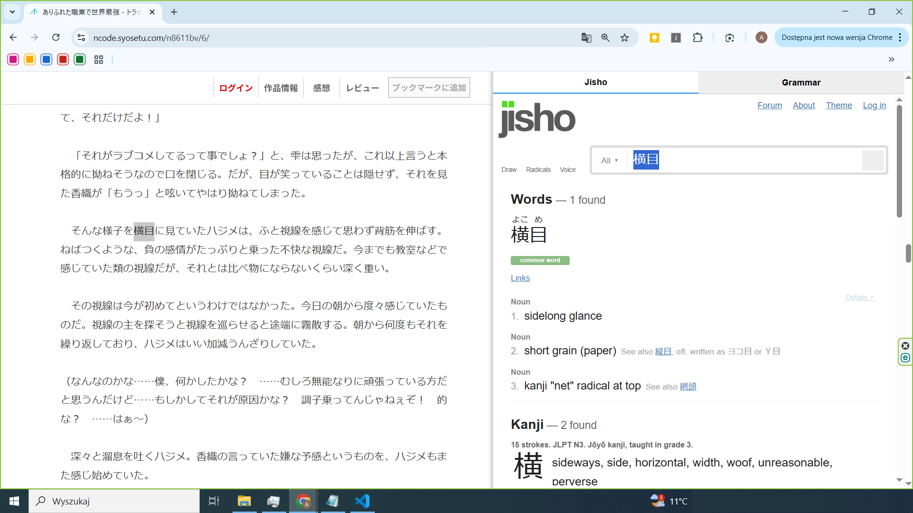
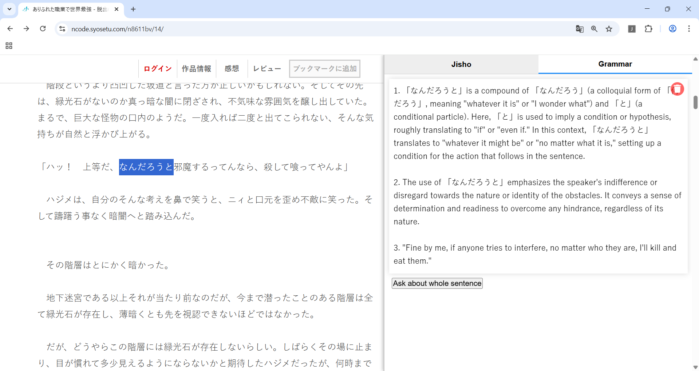

# Syosetu Japanese Reading Plugin

A Chrome extension that adds a handy side panel to the [syosetu.com](https://syosetu.com) website for quick Japanese reading support.  
Select any Japanese word or phrase, and get instant dictionary results plus grammar explanations powered by ChatGPT — all without leaving the page!

---

---

## Features

- 📖 Instant Jisho.org dictionary lookup for selected words  
- 🤖 Grammar explanations with ChatGPT AI  
- 🖥️ Works on both desktop and Android/tablet devices
- 🔄 Side panel with smooth switching between dictionary and grammar tabs  
- ⚡ Caching system for fast repeated lookups  

---

## How to Use

1. In the unpacked files rename secrets.sample.js to secrets.js
2. If you want to use the grammar feature please provide there your OpenAI API key.
3. Load the extension in Chrome.
4. Customize side panel size and jisho/grammar responses size in extension popup-settings.
5. Visit [https://syosetu.com](https://syosetu.com) and select any Japanese word or phrase  
6. The side panel will appear with dictionary results under the “Jisho” tab  
7. Switch to the “Grammar” tab to ask ChatGPT about the word or full sentence  
8. Use the buttons to send new queries if needed — results will be cached for access later  

---

## License

This project is licensed under the Apache 2.0 License - see the [LICENSE](LICENSE) file for details.

