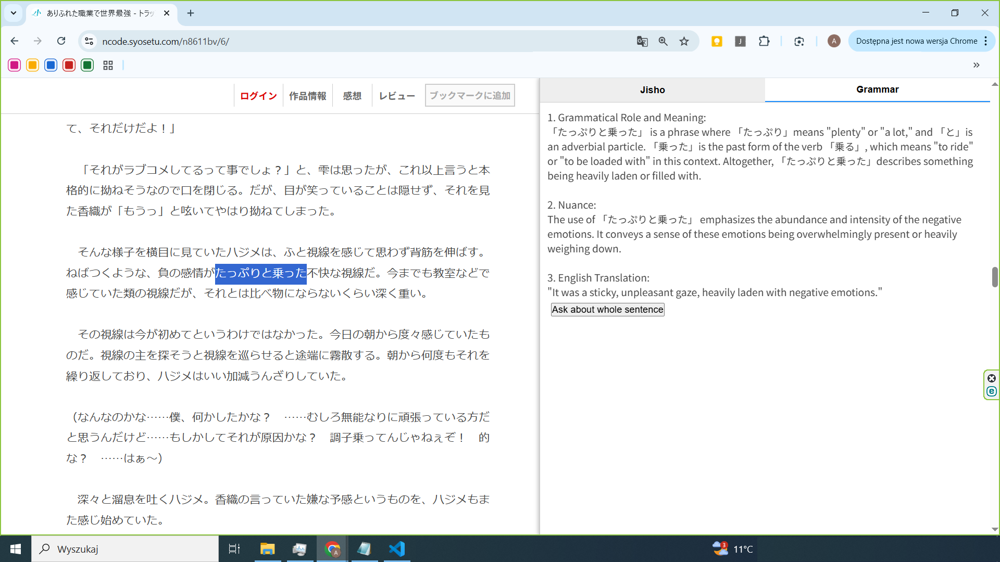

# Syosetu Japanese Reading Plugin

A Chrome extension that adds a handy side panel to the [syosetu.com](https://syosetu.com) website for quick Japanese reading support.  
Select any Japanese word or phrase, and get instant dictionary results plus grammar explanations powered by AI — all without leaving the page!

---

---

## Features

- 📖 Instant Jisho.org dictionary lookup for selected words  
- 🤖 Grammar explanations with ChatGPT or Gemini  
- 🖥️ Works on both desktop and Android/tablet devices
- 🔄 Side panel with smooth switching between dictionary and grammar tabs  
- ⚡ Caching system for fast repeated lookups  

---

## How to Use

1. *(Optional)* In the unpacked files, rename **`secrets.sample.js` → `secrets.js`**.  
2. Load the extension in Chrome (either as unpacked files or from the [Chrome Web Store](https://chromewebstore.google.com/detail/japanese-reading-assistan/ibkjbbcbfkcajkdoadkdalnmecmnaimg)) and toggle 'turno on' in  [**popup settings**](assets/settings.png).  
3. To use the **Grammar feature**, you need to provide an API key. You can do this in one of two ways:  
   - **Option A (recommended):**  
     Open the extension **popup → API Keys Settings** → paste your key(s).   
   - **Option B:**  
     Place your key in a **`secrets.js`** file inside the extension folder.  
4. *(Optional)* Customize side panel width and jisho/grammar font size in extension popup-settings.
5. Visit any Japanese site → in the popup settings, toggle **"enable on this site"** → select any Japanese word or phrase. 
6. The side panel will open, showing dictionary results under the **“Jisho”** tab.  
7. Switch to the **“Grammar”** tab to ask **ChatGPT** or **Gemini** (selectable in settings) about a word or full sentence.  
   - Highlight part of a sentence → cached grammar results for that sentence will appear as buttons in the panel.  
8. Use the buttons to send new queries if needed — results will be cached for access later  

---

## Privacy

Your API keys and recent queries are stored **only on your device**; nothing is collected or shared.  
See [PRIVACY.md](./PRIVACY.md) for details.

---

## Contributing

Contributions are welcome!  

Please read [CONTRIBUTING.md](CONTRIBUTING.md) for detailed guidelines before contributing.

---

## License

This project is available under a **Dual License**:

- **Apache License 2.0** — for personal and non-commercial use.
- **Commercial License** — required for any commercial use. Please contact the author.

By using this project you agree to the terms of one of these licenses.

See the [LICENSE](LICENSE) file for full details.

---

### Definition of Commercial Use

Commercial use means any use of the project that is intended for or directed toward commercial advantage or monetary compensation, including but not limited to:
- Integration into a paid product or service
- Redistribution for profit
- Use in commercial software

If you plan any such use, you must obtain a Commercial License from the author.
